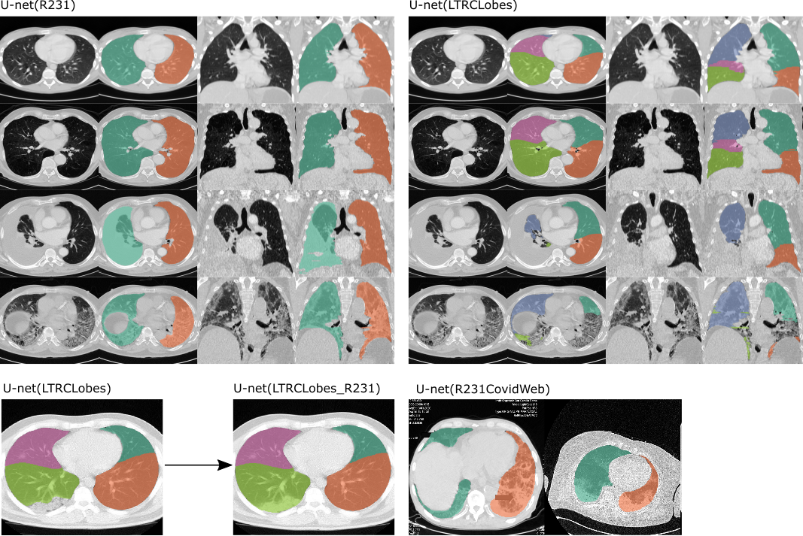

# Automated lung segmentation in CT under presence of severe pathologies

This package provides pre-trained U-net models for lung segmentation. For now, two models are available:

- U-net(R231): This model was trained on a large and diverse dataset that covers a wide range of visual variabiliy. The model performs segmentation on individual slices, extracts right-left lung seperately includes airpockets, tumors and effusions. The trachea will not be included in the lung segmentation.

- U-net(LTRCLobes): This model was trained on a subset of the LTRC dataset. The model performs segmentation of individual lung-lobes but yields limited performance with respect to very dense pathologies. 

**Examples of the two models applied**. **Left:** U-net(R231), will distinguish between left and right lung and include very dense areas such as effusions or tumor (second row). **Right:** U-net(LTRLobes), will distinguish between lung lobes but will not include very dense areas.


Detailed description of the dataset used and a thorough evaluation of the U-net(R231) model can be found here:
* Hofmanninger et al., ---


## Installation
```
pip install git+https://github.com/JoHof/lungmask
```

## Usage
### As a command line tool:
```
lungmask INPUT OUTPUT
```
If INPUT points to a file, the file will be processed. If INPUT points to a directory, the directory will be searched for DICOM series. The largest volume found (in terms of number of voxels) will be used to compute the lungmask. OUTPUT is the output filename. All ITK formats are supported.

Choose a model:
The U-net(R231) will be used as default. To change inference to an alternative model, e.g. LTRCLobes type:

```
lungmask INPUT OUTPUT --modeltype unet --modelname LTRCLobes
```

For additional options type:
```
lungmask -h
```

### Use lungmask as a python module:

```
import lungmask from lungmask

OUTPUT = lungmask.apply(INPUT)  # default model is U-net(R231)
```
INPUT has to be a SimpleITK object.

To change the model use:
```
import lungmask from lungmask

model = lungmask.get_model('unet','LTRCLobes')
OUTPUT = lungmask.apply(INPUT, model)


 
